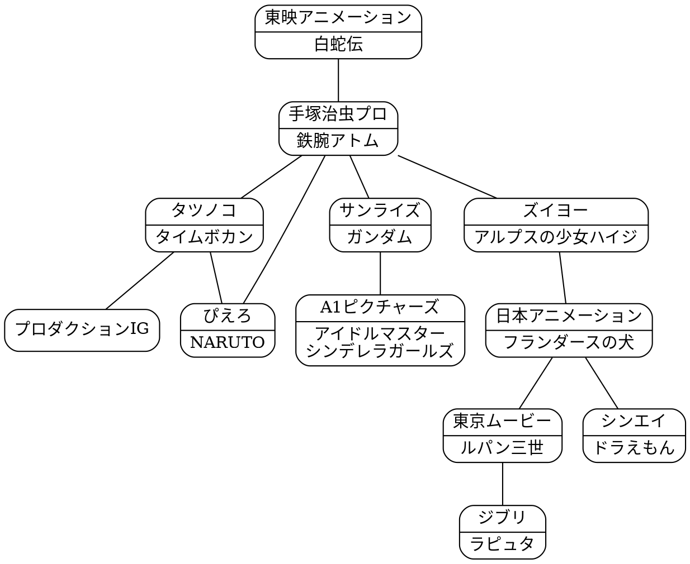

# アニメスタジオの系図

```graphviz
graph tree {
    
    toei [label="{ 東映アニメーション | 白蛇伝 }" shape=Mrecord]

    mushi [label="{ 手塚治虫プロ | 鉄腕アトム }" shape=Mrecord]
    
    toei -- mushi 
    
    tatsunoko [label="{ タツノコ | タイムボカン }" shape=Mrecord]

    mushi -- tatsunoko
    
    sunrize [label="{ サンライズ | ガンダム }" shape=Mrecord]
    
    mushi--sunrize

    ig [label="{ プロダクションIG }" shape=Mrecord]

    tatsunoko -- ig

    zuiyo [label="{ ズイヨー| アルプスの少女ハイジ }"   shape=Mrecord]
    
    mushi -- zuiyo
    
    piero [label="{ ぴえろ | NARUTO }" shape=Mrecord]
    
    mushi-- piero
    tatsunoko -- piero
    
    nihon [label="{ 日本アニメーション | フランダースの犬 }" shape=Mrecord]
   
   sunrize -- a1
   
   a1[ label="{ A1ピクチャーズ | アイドルマスター\nシンデレラガールズ }" shape=Mrecord ]
   
    zuiyo -- nihon
    
    tokyo [label="{ 東京ムービー | ルパン三世 }" shape=Mrecord]

    nihon -- tokyo

    shinei [label="{ シンエイ | ドラえもん }" shape=Mrecord]

    nihon -- shinei
    
    ghibli [label="{ ジブリ | ラピュタ }" shape=Mrecord]

    tokyo -- ghibli

    }

```